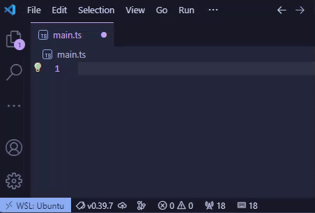

# APM Pulse

Game-style APM counter for your VS Code status bar.

## Features

- Displays real-time actions per minute in the bottom status bar.
  - Typing
  - Open/close file
  - Cursor location in file
  - Terminal usagebar (keyboard icon)
- Command palette integration
- Customizable settings

## Commands

The following commands are available through the VS Code command palette (Ctrl+Shift+P).

| Command      | Description                                                 |
| :----------- | :---------------------------------------------------------- |
| Reset totals | Resets the APM counter's total stat accumulation mechanism. |
| Show totals  | Displays a message with your APM stats.                     |

## Settings

The following settings are available in the user settings screen in Extensions > APM Pulse.

| Setting   | Description                             |
| :-------- | :-------------------------------------- |
| Alignment | Horizontal alignment in the status bar. |

## License

This software is distributed under the terms of the [MIT License](/LICENSE).

### Attributions

- Mouse icon by sentya irma from [Noun Project](https://thenounproject.com/browse/icons/term/mouse/) (CC BY 3.0)
